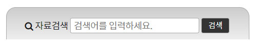

<h1>HTML CSS 수업정리 </h1>
<cite>참고사이트(김데레사님의 웹접근성과 웹표준) : https://seulbinim.github.io/WSA/ </cite><br>
<cite>웹카페 실습 자료 : https://seulbinim.github.io/exHTML5/</cite>


## 웹관련 용어 완성 이미지


## 정의형 목록 태그
> 위의 웹관련 용어 완성 이미지의 경우 정의형 목록태그인 dl , dt, dd 로 markup했다.

#### 정의형 목록 태그 사용 방법
```
<dl>
  <dt>Coffee</dt> // 목록의 이름을 정의할때
  <dd>Black hot drink</dd> // 목록의 설명을 정의할때
  <dt>Milk</dt>
  <dd>White cold drink</dd>
</dl>

html5에서부터는 dl 안에 div 태그로 감싸는걸 허용한다.
하지만 div 태그 안에는 dt dd가 모두 감싸는 것만 허용한다.
```

### 웹관련용어 markup
```
<section class="term">
    <h2 class="term-heading">웹 관련 용어</h2>
    <dl class="term-list">
        <div class="clearfix">
            <dt class="term-list-subject">
                <a href="#">웹 표준 이란?</a>
            </dt>
            <dd class="term-list-thumbnail">
                
            </dd>
            <dd class="term-list-brief">
                W3C 단체에서 규정한 웹 기술 사양에 대한 규칙을 말하며 표준 규격은...
            </dd>
        </div>
        <div class="even clearfix">
            <dt class="term-list-subject">
                <a href="#">웹 표준 이란?</a>
            </dt>
            <dd class="term-list-thumbnail">
                
            </dd>
            <dd class="term-list-brief">
                W3C 단체에서 규정한 웹 기술 사양에 대한 규칙을 말하며 표준 규격은...
            </dd>
        </div>
    </dl>
</section>
```

### 웹관련 용어 css
```
.term{
    margin-top:20px;
    background:#ccc linear-gradient(#ccc, #eee);
    border:1px solid #aaa;
    border-radius: 5px;
    padding:10px 15px;
    /* 그라디언트 지원 안하는 브라우저를 위해서 맨 앞에 배경 색깔을 지정해준다. */
}
.term-heading{
    font-size:1.5rem;
    font-weight: 700;
}

.term div{
    margin-top:10px;
}
.term-list-subject{
    margin-top:-4px;
}
.term-list-subject, .term-list-brief{
    float: right;
    width:145px;
}
.term-list-thumbnail{
    float: left;
}
.term-list-thumbnail img{
    vertical-align: top;
}

.term-list-brief{
    margin-top:5px;
}
.even .term-list-subject, .even .term-list-brief{
    float: left;
}
.even .term-list-thumbnail{
    float: right;
}
```

> 정렬하는 여러가지 방법중 float 사용하여 정렬하기


## 자료검색 완성 이미지


### 자료검색 markup
```
<section class="search">
    <h2 class="readable-hidden">검색</h2>
    <form action="https://formspree.io/midahaha@naver.com" method="post" class="search-form">
        <fieldset>
            <legend>검색 폼</legend>
            <div class="search-container">
                <label for="search" class="icon-search">자료검색</label>
                <input type="search" placeholder="검색어를 입력하세요." id="search" required>
                <button type="submit" class="btn-search">검색</button>
            </div>
        </fieldset>                       
    </form>
</section>
```

### 자료검색 css
```
.search{
    background: #ccc linear-gradient(#ccc,#eee);
    border:1px solid #aaa;
    border-bottom:0;
    border-radius: 15px 15px 0 0;
    padding:15px 25px 10px;
}
.search-form input{
    width:195px;
    height:24px;
    border:1px solid #aaa;
    border-radius: 3px;
    padding:1px 1px 1px 5px;
}
.btn-search{
    border:1px solid #aaa;
    border-radius: 3px;
    padding:1px 10px;
    height:24px;
    background: #333;
    color:#fff;
    font-size:85%
}
.search-container{
    display: flex;
    justify-content: space-between;
    align-items: center;
}

```
> 자료검색은 flex 사용하여 정렬함
