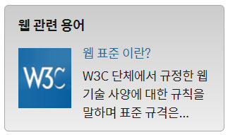

<h1>HTML CSS 수업정리 </h1>
<cite>참고사이트(김데레사님의 웹접근성과 웹표준) : https://seulbinim.github.io/WSA/ </cite><br>
<cite>웹카페 실습 자료 : https://seulbinim.github.io/exHTML5/</cite>

## 웹관련 용어 완성 이미지


### 웹관련용어 markup
```
<section class="term">
    <h2 class="term-heading">웹 관련 용어</h2>
    <dl class="term-list">
        <div class="clearfix">
            <dt class="term-list-subject">
                <a href="#">웹 표준 이란?</a>
            </dt>
            <dd class="term-list-thumbnail">
                
            </dd>
            <dd class="term-list-brief">
                W3C 단체에서 규정한 웹 기술 사양에 대한 규칙을 말하며 표준 규격은...
            </dd>
        </div>
        <div class="even clearfix">
            <dt class="term-list-subject">
                <a href="#">웹 표준 이란?</a>
            </dt>
            <dd class="term-list-thumbnail">
                
            </dd>
            <dd class="term-list-brief">
                W3C 단체에서 규정한 웹 기술 사양에 대한 규칙을 말하며 표준 규격은...
            </dd>
        </div>
    </dl>
</section>
```

### 웹관련 용어 css
```
.term{
    margin-top:20px;
    background:#ccc linear-gradient(#ccc, #eee);
    border:1px solid #aaa;
    border-radius: 5px;
    padding:10px 15px;
    /* 그라디언트 지원 안하는 브라우저를 위해서 맨 앞에 배경 색깔을 지정해준다. */
}
.term-heading{
    font-size:1.5rem;
    font-weight: 700;
}

.term div{
    margin-top:10px;
}
.term-list-subject{
    margin-top:-4px;
}
.term-list-subject, .term-list-brief{
    float: right;
    width:145px;
}
.term-list-thumbnail{
    float: left;
}
.term-list-thumbnail img{
    vertical-align: top;
}

.term-list-brief{
    margin-top:5px;
}
.even .term-list-subject, .even .term-list-brief{
    float: left;
}
.even .term-list-thumbnail{
    float: right;
}
```

