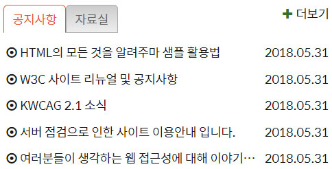
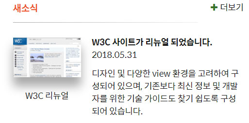

<h1>HTML CSS 수업정리 </h1>
<cite>참고사이트(김데레사님의 웹접근성과 웹표준) : https://seulbinim.github.io/WSA/ </cite><br>
<cite>웹카페 실습 자료 : https://seulbinim.github.io/exHTML5/</cite>

## 게시판 완성 이미지


### 게시판 markup
```
<div class="board">
    <section class="notice board-act">
        <h2 id="notice" class="tab notice-heading" tabindex="0">공지사항</h2> // tabindex="0" 으로 키보드 포커스 받을 수 있게 
        <ul class="board-list notice-list">
            <li class="icon-dot-circled">
                <a href="#">HTML의 모든 것을 알려주마 샘플 활용법</a>
                <time datetime="2019-04-09T11:18:27">2019.04.09</time>
            </li>
            <li class="icon-dot-circled">
                <a href="#">W3C 사이트 리뉴얼 및 공지사항</a>
                <time datetime="2019-04-09T11:18:27">2019.04.09</time>
            </li>
            <li class="icon-dot-circled">
                <a href="#">KWCAG 2.1 소식</a>
                <time datetime="2019-04-09T11:18:27">2019.04.09</time>
            </li>
            <li class="icon-dot-circled">
                <a href="#">서버 점검으로 인한 사이트 이용안내 입니다.</a>
                <time datetime="2019-04-09T11:18:27">2019.04.09</time>
            </li>
            <li class="icon-dot-circled">
                <a href="#">여러분들이 생각하는 웹 접근성에 대해 이야기를 나누어 봅시다.</a>
                <time datetime="2019-04-09T11:18:27">2019.04.09</time>
            </li>
        </ul>
        <a href="#" class="icon-plus board-more notice-more" title="공지사항" aria-labelledby="notice">더보기</a>
    </section>
    <section class="pds">
        <h2 id="pds" class="tab pds-heading" tabindex="0">자료실</h2>
        <ul class="board-list pds-list">
            <li class="icon-dot-circled">
                <a href="#">디자인 사이트 링크 모음</a>
                <time datetime="2019-04-09T11:18:27">2019.04.09</time>
            </li>
            <li class="icon-dot-circled">
                <a href="#">웹 접근성 관련 자료 모음</a>
                <time datetime="2019-04-09T11:18:27">2019.04.09</time>
            </li>
            <li class="icon-dot-circled">
                <a href="#">예제 샘플 응용해보기</a>
                <time datetime="2019-04-09T11:18:27">2019.04.09</time>
            </li>
            <li class="icon-dot-circled">
                <a href="#">웹 접근성 향상을위한 국가 표준 기술 가이드라인</a>
                <time datetime="2019-04-09T11:18:27">2019.04.09</time>
            </li>
            <li class="icon-dot-circled">
                <a href="#">로얄티 프리 이미지 자료</a>
                <time datetime="2019-04-09T11:18:27">2019.04.09</time>
            </li>
        </ul>
        <a href="#" class="icon-plus board-more pds-more" title="자료실" aria-labelledby="pds">더보기</a>
    </section>
</div>
```
> tabindex="0" 을 입력함으로서 키보드 포커스 받을 수 있게 설정.
> 게시판의 날짜의 경우 의미있는 태그인 time 태그로 사용하는걸 권장.
> time 태그의 속성으로는 datetime="" 을 설정해준다.

### 게시판 웹접근성 Aria
```
Role = " 역활을 바꿔서 설정 "
Aria 사용하려면 id를 많이 사용한다.
Aria 속성중 aria-labelledby속성을 가장 많이 사용..
aria-labelledby="notice" <- notice란 아이디를 가진 레이블
<section class="notice board-act">
	<h2 id="notice" class="tab notice-heading" tabindex="0">공지사항</h2>
	<ul class="board-list notice-list">
		<li class="icon-circled">
		<a href="#"></a>
		<time datetime="2019-04-09T11:18:27">2019.04.09</time>
		</li>
	</ul>
	<a href="#" class="icon-plus board-more notice-more" aria-label="공지사항" title="공지사항" aria-labelledby="notice">더보기</a>
</section>
Aria를 사용하면 스크린리더기가 공지사항의 더보기 버튼이라고 읽어준다.
```


### 게시판 css
```
.board{
    position: relative;
    margin-top:20px;
    min-height: 180px;
}
.tab{
    position: absolute;
    top:0;
    padding:5px 10px;
    color:#333;
    border:1px solid #aaa;
    border-radius: 5px 5px 0 0;
    background: #ccc linear-gradient(#ccc,#eee);
    cursor: pointer;
}
.notice-heading{
    left:0;
}
.pds-heading{
    left:73px;
}
.board-act .tab{
    border-color:#e25d2d #e25d2d #fff #e25d2d;
    background: #fff;
    color:#e25d2d;
}
.board-list{
    /* background: hsla(30,50%,50%,0.5); */
    padding-top:45px;
}
.board-more{
    position: absolute;
    top:-8px;
    right:-8px;
    padding:8px; /* 패딩을 추가한 바람에 top, right, 좌표를 음수로 줌 */
}
.board-list li{
    display: flex;
    justify-content: space-between;
    align-items: center;
    margin:8px 0px;
}
.board-list a{
    width:270px;
    white-space: nowrap;
    overflow: hidden;
    text-overflow: ellipsis;
}
.board-list, .board-more{
    display: none;
}
.board-act .board-list, .board-act .board-more{
    display: block;
}
.board-more::before{
    color:hsl(110, 90%, 30%, 1)
}

```

### 게시판 javascript
```
var item = $('.menu-item');
var itemSubLink = $('.sub-menu a');
var tab = $('.tab');
var section = $('.notice, .pds');
/*
    item.attr('tabindex', '0');
    마크업에 tabindex를 안 넣었을 경우, 스크립트에서 추가하면 된다.
*/
itemSubLink.attr('class', 'icon-dot-circled'); // sub-menu a 를 찾아서 icon-dot-circled 클래스를 추가해준다.

// 메인 메뉴의 하위 메뉴 제어를 위한 스크립트 
// Focusin 포커스를 받았을때 

// on이라는 이벤트 메소드는 멀티 이벤트를 사용할 수 있다

/*
    item.on('mouseover', function(){
        item.removeClass('menu-act');
        $(this).addClass('menu-act'); // 클래스를 생성하라는 명령어이기 때문에 . 은생략 
    }); 

    item.on('focusin', function(){ // 포커스를 받게 추가해줌 
        item.removeClass('menu-act');
        $(this).addClass('menu-act');
    })
*/

item.on('mouseover focusin', function(){
    item.removeClass('menu-act');
    $(this).addClass('menu-act'); // 클래스를 생성하라는 명령어이기 때문에 . 은생략 
}); 


/* 탭 콘텐츠 제어를 위한 스크립트
    tab.on('click', function(){
        section.removeClass('board-act');
        $(this).parent().addClass('board-act');
    });
*/

tab.on('click keyup', function(e){
    e.preventDefault();
    if(e.keyCode === 32 || e.keyCode === 13 || e.type === 'click'){
        section.removeClass('board-act');
        $(this).parent().addClass('board-act');
    }
});
```

## 뉴스 완성 이미지


### 뉴스 markup
```
<section class="news">
    <h2 class="news-heading">새소식</h2>
    <article class="news-item">
        <a href="#">
            <h3 class="news-item-subject">W3C사이트가 리뉴얼 되었습니다.</h3>
            <time class="news-item-date" datetime="2019-04-11T11:19:37">2019.04.11</time>
            <p class="news-item-brief">
                디자인 및 다양한 view 환경을 고려하여 구성되어 있으며, 
                기존보다 최신 정보 및 개발자를 위한 기술 가이드도 
                찾기 쉽도록 구성되어 있습니다.  
            </p>
            <figure class="news-item-thumbnail">
                
                <figcaption>W3C 리뉴얼</figcaption>
            </figure>
        </a>
    </article>
    <a href="#" class="news-more icon-plus" title="새소식" target="_blank">더보기</a>
</section>
```
#### HTML5 figure
```
<figure>
  
  <figcaption>Fig.1 - Trulli, Puglia, Italy.</figcaption>
</figure>

Figcaption 의 경우 이미지에 맞는 의미를 가진 설명일 경우에 작성한다.
예를들어 쇼핑의 옷이미지+여신핏글자 일경우, 이런 경우는 이미지에 맞는 텍스트라고 보기에는 적절하지 않을 수 있다.
Figcaption을 사용할 때 이미지에 맞는 적절한 설명인지를 고민해봐야한다.
```

### 뉴스 css
```
.news{
    position: relative;
    margin-top:20px;
}
.news::before{
    content: "";
    position: absolute;
    top:35px;
    left:0;
    width:80%;
    height:1px;
    background: #aaa linear-gradient(to right, #aaa, #fff);
}
.news-heading{
    color:#e25d2d;
    font-size:1.5rem;
    font-weight: 700;
}
.news-item{
    position: relative;
    margin-top:35px;
    min-height: 150px;
}
.news-item a{
    display: block;
    padding-left:130px;
}
.news-item-thumbnail{
    position: absolute;
    top:3px;
    left:0;
    text-align: center;
}
.news-item-thumbnail img{
    margin-bottom: 15px;
    box-shadow: 0 10px 15px 5px #aaa; /* x값 y값 블러값 */
}
.news-item-subject{
    font-size:1.5rem;
}
.news-item-date{
    font-size:1.3rem
}
.news-item-brief{
    margin-top:10px;
    line-break: 1.5;
}
.news-more{
    position: absolute;
    top:-8px;
    right:0;
    padding:8px;
}
.news-more::before, .favorite-more::before{
    color:green
}
```

