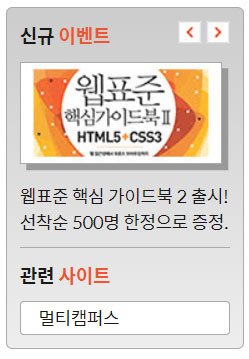

<h1>HTML CSS 수업정리 </h1>
<cite>참고사이트(김데레사님의 웹접근성과 웹표준) : https://seulbinim.github.io/WSA/ </cite><br>
<cite>웹카페 실습 자료 : https://seulbinim.github.io/exHTML5/</cite>

## 신규이벤트 완성 이미지


### 신규이벤트 markup
```
<div class="event-related">
    <section class="event">
        <h2 class="event-heading">신규 <span>이벤트</span></h2>
        <div id="event-detail">
                <p></p>
                <p><em>웹표준 핵심 가이드북 2 출시!</em> 선착순 500명 한정으로 증정.</p>
        </div>
        <div class="btn-event">
            <button type="button" class="btn-event-prev" aria-label="이전 이벤트 보기"></button>
            <button type="button" class="btn-event-next" aria-label="다음 이벤트 보기"></button>
        </div>
    </section>
    <section class="related">
        <h2 class="related-heading">관련 <span>사이트</span></h2>
        <ul class="related-list">
            <li><a href="#">패스트 캠퍼스</a></li>
            <li><a href="#">W3C</a></li>
            <li><a href="#">CSS ZenGarden</a></li>
            <li><a href="#">웹접근성 연구소</a></li>
            <li><a href="#">Web Standards</a></li>
        </ul>
    </section>
</div>
```

### 신규이벤트 css
```
/* 신규 이벤트 및 관련 사이트 */
.event-related{
    background: #aaa linear-gradient(#ccc, #eee);
    border:1px solid #aaa;
    border-radius: 5px;
    padding:10px;
}

.event{
    position: relative;
}
.event-heading{
    font-size:1.5rem;
    font-weight: 700;
}
.event-heading span, .related span, .favorite-heading span{
    color:#e25d2d;
}
.event p{
    margin:10px 0px;
}
.event-thumbnail{
    border:1px solid #aaa;
    box-shadow: 5px 5px #999;
}
.btn-event{
    height:18px;
    padding:4px;
    position: absolute;
    top:3px;
    right:0;
}
.btn-event-prev, .btn-event-next{
    width:19px;
    height:18px;
    border:0;
    background: pink;
    background: url(images/back_forward.png) no-repeat;
}

.btn-event-next{
    background-position: 100% 0;/* 상자의 오른쪽 과 배경의 오른쪽에 매칭된다. */
}
/* 관련사이트 */
.related{
    border-top:1px solid #aaa;
    padding-top:10px;
}
.related-heading, .favorite-heading{
    font-size:1.5rem;
    font-weight: 700;
}

.related-list {
    margin-top:10px;
    height:27px;
    overflow: hidden;
    transition: all .4s;
    background: #fff;
    border:1px solid #aaa;
    border-radius: 5px;
    padding:0px 5px;
}

.related-list li a{
    display: block;
    text-indent:1em; /* 한글자만큼 들여쓰기 */
    line-height: 25px;
}
.list-act{
    height:147px;
    padding:10px 5px;
}

```

### 관련사이트 javascript
```
// 관련 사이트 목록 제어를 위한 스크립트 
var list = $('.related-list');
list.on('mouseover focusin', function(){
  $(this).addClass('list-act');
});
list.on('mouseout focusout', function(){
  $(this).removeClass('list-act');
});

```