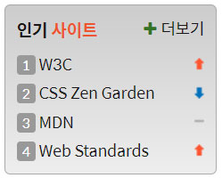

<h1>HTML CSS 수업정리 </h1>
<cite>참고사이트(김데레사님의 웹접근성과 웹표준) : https://seulbinim.github.io/WSA/ </cite><br>
<cite>웹카페 실습 자료 : https://seulbinim.github.io/exHTML5/</cite>

## 인기사이트 완성 이미지


### 인기사이트 markup
```
<section class="favorite">
    <h2 class="favorite-heading">인기 <span>사이트</span></h2>
    <ol class="favorite-list">
        <li class="no1"><a href="#">W3C</a><em class="up">상승</em></li>
        <li class="no2"><a href="#">Fast Campus</a><em class="down">하락</em></li>
        <li class="no3"><a href="#">MDN</a><em class="stop">멈춤</em></li>
        <li class="no4"><a href="#">Web Standards</a><em class="up">상승</em></li>
    </ol>
    <a href="#" class="favorite-more icon-plus" title="인기사이트 더보기">더보기</a>
</section>
```

### 인기사이트 css
```
 .favorite{
    position: relative;
    border:1px solid #aaa;
    border-radius: 5px;
    margin-top:20px;
    padding:10px 10px 5px 10px;
    background: #ccc linear-gradient(#ccc, #eee);
}
.favorite-more{
    position: absolute;
    padding:8px;
    top:2px;
    right:2px;
}
.favorite-more::before{
    color:green
}
.favorite-list{
    margin-top:5px;
    overflow: hidden;
    counter-reset: 0;
}
.favorite-list li{
    counter-increment: number;
    margin:5px 0;
    /* display: flex;
    align-items: center; */
     position: relative; 
}
.up, .down, .stop{
    position: absolute;
    top:50%;
    right:0;
    width:9px;
    height:11px;
    padding-top:11px;
    overflow: hidden;
    background: url("images/rank.png") no-repeat;
    margin-top:-5px;
    /* margin-left:auto; */
}
.stop{background-position: 0 50%;}
.down{background-position: 0 100%;}
.favorite-list li::before{
    content: counter(number);
    background: #aaa;
    color:#fff;
    font-size:1.2rem;
    display: inline-block; 
    padding:0 5px;
    margin-right:5px;
    border-radius: 2px;
} 
```

## IR(Image Replacement) technique - 이미지 대체 기법

* 웹 접근성을 준수하기 위한 필수 사항 중 하나는 이미지에 대체 텍스트를 제공하는 것